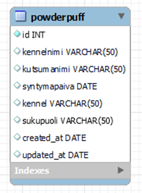

# GraphQL CRUD with MYSQL Database example

## A second-level heading
+ Add new dog
+ Show all dogs
+ Show dog by ID
+ Delete dog by ID
+ Upadate dog by ID

## Specs
Database: MySQL
Language: JavaScript
Server/runtime environment: NodeJS

1. Picture. Database table.

Date: 6/2023
> Nina Päivinen
